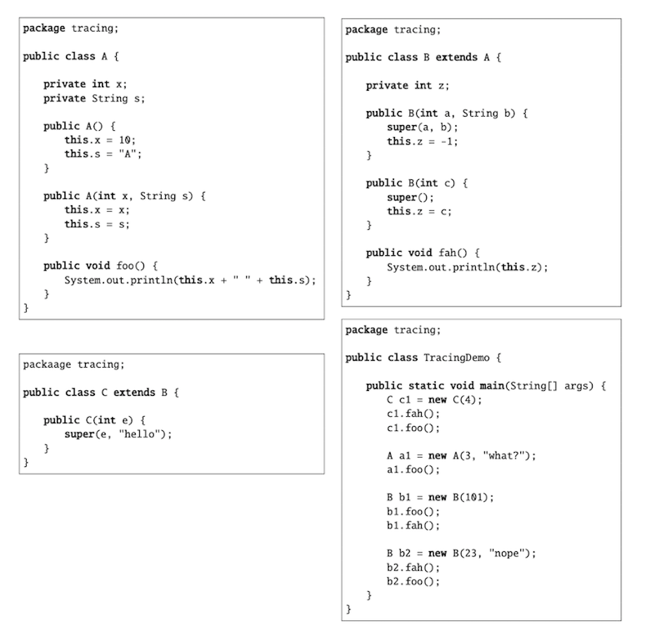

###### CS-207-3: Programming II <br> Spring 2021 <br> Northeastern Illinois University <br> Homework #5 <br> Due Date: 03/03/21 at 9:00 p.m. (CT) <br> Inheritance

**Getting Started**

**1.** Clone the assignment to your computer.<br>
**2.** Go to File > Project Structure. Under Project Settings, click on Project and verify that the Project SDK is set
to JDK 11 or higher.  If it is not, select the correct SDK from the drop-down.<br>
**3.** Go to File > Settings (Mac: IntelliJ IDEA > Preferences). Under Build, Execution, Deployment and under Build
Tools, click Gradle. Make sure Build and run using: and Run tests using: are set to Gradle. Make sure Use Gradle from:
is set to 'gradle-wrapper.properties' file. And make sure Gradle JVM is set to JDK 11 or higher.<br>
**4.** Project SDK and Gradle JVM should be set to the same Java version.<br>
**5.** Create the `main/java` directory in the `src` directory. This is where you will be creating your Java classes for
your assignment. Right click `src` and go to New > Directory and select `main/java`.<br>

**Submitting your assignment**

**1.** Once you have completed all the problems, commit your final code to GitHub - remember to run all
  the unit tests and the code analyzers. <br>
**2.** Then in IntelliJ, go to File, select Export to Zip File. This will create a zip file of the entire project directory.<br>
**3.** Submit the .zip file to the Homework 5 Assignment folder on D2L.<br>

### Problem 1

1. In the `main/java` directory, create a package named `tracing`. Create the following classes inside the 
`tracing` package (note each class goes in its own file!): <br>
   <br>
   
   <br><br>

2. Use the debugger to step through the code in the `main` method.
3. Put the output for the code as comments above the `main` method in the `TracingDemo` class. 
4. Commit and push to GitHub.

### Problem 2: Inheritance

1. In the `main/java` directory, create a package named `problem2`. 
2. In the `problem2` directory, create a class named `AppleDevice` that has/does the following:
   - Three private (i.e. encapsulated) instance variables: A String named `name`, a double named
     `price`, and a long named `serialNumber`. The `name` and `serialNumber` instance variables
     should both be `final`.
   - A constructor that takes three parameters: A String, a double, and a long (in that order) 
     and sets the instance variable.
   - A getter and setter for the `price` instance variable.
   - Uncomment and run the following tests in the `test/problem2/AppleDeviceTest.java` file:
      - `shouldTestGetPriceInAppleDevice`
      - `shouldTestSetPriceInAppleDevice`
   - Override the `toString` method to return the name, followed by a space, followed by the serial number.
   - Uncomment and run the following test in the `test/problem2/AppleDeviceTest.java` file:
      - `shouldTestToStringInAppleDevice`
   - Run the code analyzers. If they pass, commit and push your code to GitHub.
2. In the `problem2` directory, create a Java class named `IPhone` that inherits from `AppleDevice` 
   that has/does the following:
   - An encapsulated (and final) instance variable: A String named `generation`
   - A constructor that takes 4 parameters (String, double, long, String) and sets the superclass instance 
     variables and then the `generation` instance variable.
   - A getter for the `generation` instance variable.
   - Uncomment and run the following tests in the `test/problem2/IPhoneTest.java` file:
     - `shouldTestGetGenerationInIPhone`
     - `shouldTestInheritanceForIPhone`
   - Override the `toString` method to return the name, followed by a space, followed by a serial number 
     followed by a space and then the generation. **Do not add any additional methods other than the ones
     explicitly described in the instructions.**
   - Uncomment and run the following test in the `test/problem2/IPhoneTest.java` file:
     - `shouldTestToStringInIPhone`
   - Run the code analyzers. If they pass, commit and push your code to GitHub.
3. In the `problem2` directory, create a Java class named `DeviceDemo` that has/does the following:
   - The `main` method. In the `main` method, create a several `AppleDevice` and `IPhone` objects and
     print out the results of calling the `toString` method on the reference variables.
   - Run the code analyzers. If they pass, commit and push your code to GitHub.

### Problem 3: Aggregation

1. In the `main/java` directory, create a package named `problem3`. 
2. In the `problem3` directory, create a class named `Student` that has/does the following:
    - An encapsulated (and final) instance variable: A String named `name`.
    - A constructor that takes one parameter (a String) and sets the instance variable.
    - A getter for the instance variable.
    - Override the `toString` method to return the name. 
    - Uncomment and run the following tests in the `test/problem3/StudentTest.java` file:
        - `shouldTestToString`
3. In the `problem3` directory, create a class named `Faculty` that has/does the following:
    - An encapsulated (and final) instance variable: A String named `name`.
    - A constructor that takes one parameter (a String) and sets the instance variable.
    - A getter for the instance variable.
    - Override the `toString` method to return the name.
    - Uncomment and run the following tests in the `test/problem3/FacultyTest.java` file:
        - `shouldTestToString`
4. In the `problem3` directory, create a class named `Course` that has/does the following:
    - An encapsulated (and final) instance variable: A long named `courseId`.
    - An encapsulated (and final) instance variable: A String named `name`.
    - An encapsulated instance variable: A `Faculty` named `instructor`.
    - An encapsulated instance variable: A 1D `Student` array named `students`.
    - A constructor that takes two parameters (a long and a String) and sets the `courseId` 
      and `name` instance variables. The constructor should also initialize the `students` array
      to hold 30 elements.
    - A getter and setter for the `instructor` instance variable.
    - Override the `toString` method to return the `courseId` followed by a space, followed by the `name`.
    - A method named `addStudent` that takes one parameter, a `Student` and does not return anything. The 
      method should add the `Student` to the first non-null location in the array. To check if something
      is `null`, you use `==` (ex: `students[0] == null`). For this exercise, you can assume that the
      array will always have a null value somewhere in the array.
    - Uncomment and run the following tests in the `test/problem3/CourseTest.java` file:
        - `shouldTestToString`
        - `shouldTestGetSetInstructor`
    - A method named `displayCourseInfo` that prints out the following information:
        - The course id and course name (use methods that you've already written!) on one line
        - `Instructor:` followed by the instructor name on one line
        - `Students:` followed by the name of each student in the course on its own line.
    - Run the code analyzers. If they pass, commit and push your code to GitHub.
5. In the `problem3` directory, create a class named `CourseDemo` with the `main` method. In the `main`
method, add the following code:
```
Course course = new Course(7394, "Programming II");
Faculty f = new Faculty("Dr. Dean Harding");
course.setInstructor(f);
Student s1 = new Student("Francis James");
Student s2 = new Student("Jenna Williams");
Student s3 = new Student("Carole King");
course.addStudent(s1);
course.displayCourseInfo();
course.addStudent(s2);
course.addStudent(s3);
course.displayCourseInfo();
```
6. If you created the classes correctly, you will see the following output:
```
7394 Programming II
Instructor: Dr. Dean Harding
Students:
Francis James
7394 Programming II
Instructor: Dr. Dean Harding
Students:
Francis James
Jenna Williams
Carole King
```
7. Run the code analyzers. If they pass, commit and push your code to GitHub.
